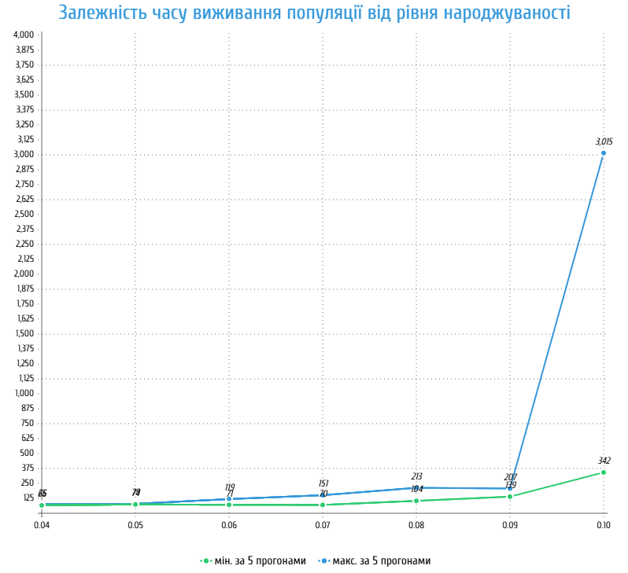
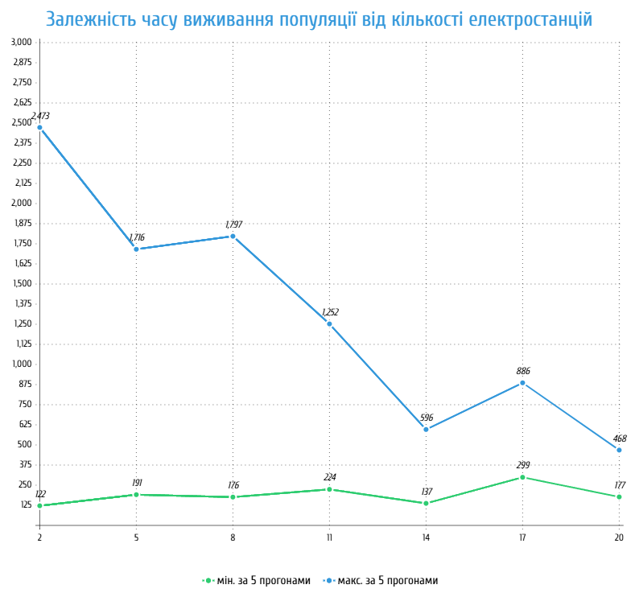
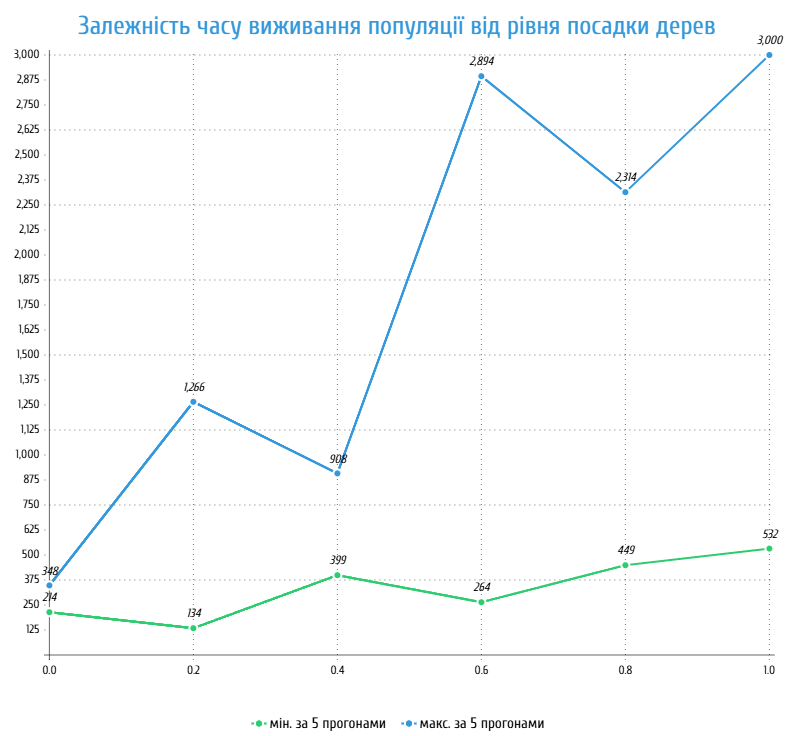
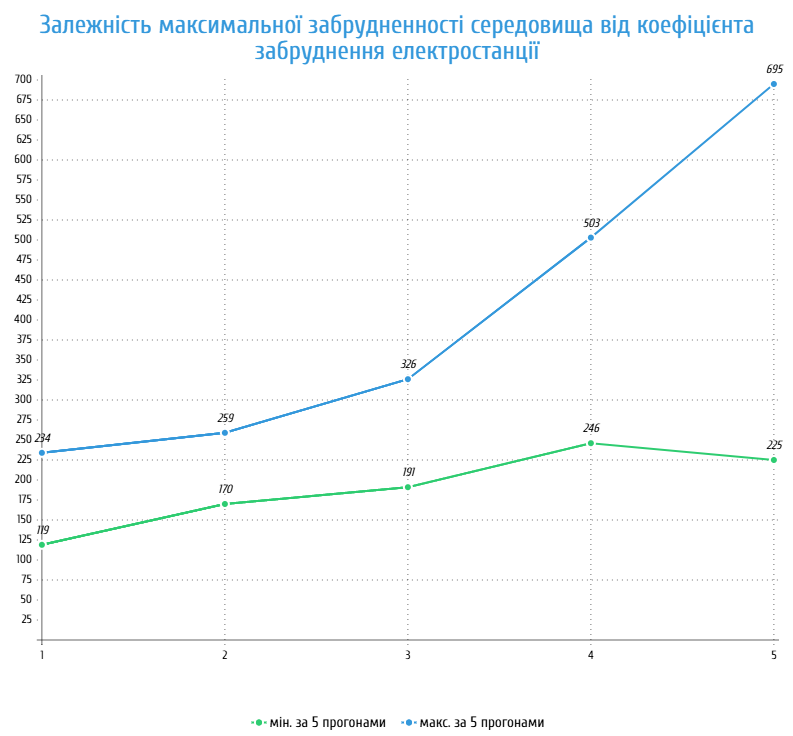

## Комп'ютерні системи імітаційного моделювання
## СПм-24-4, **Ткач Пилип Валерійович**
### Лабораторна робота №**1**. Опис імітаційних моделей та проведення обчислювальних експериментів

 

### Варіант 4, модель у середовищі NetLogo:
[Urban Suite - Pollution](https://www.netlogoweb.org/launch#http://www.netlogoweb.org/assets/modelslib/Curricular%20Models/Urban%20Suite/Urban%20Suite%20-%20Pollution.nlogo)

 

### Вербальний опис моделі:
Модель імітує взаємодію трьох типів агентів у замкнутій екосистемі: людей, джерел забруднення (електростанцій) та дерев. Забруднення негативно впливає на здоров’я людей, знижуючи їхню здатність до розмноження. Люди можуть садити дерева, які очищують середовище та зменшують рівень забруднення. Таким чином, модель демонструє динаміку «хижака і жертви», де забруднення виступає хижаком, а люди - жертвами.

### Керуючі параметри:
- **initial-population** визначає кількість людей на початку симуляції.
- **birth-rate** визначає імовірність народження дитини кожним агентом за умови достатнього рівня здоров’я.
- **planting-rate** визначає імовірність, з якою людина садить дерево.
- **power-plants** визначає кількість джерел забруднення у світі.
- **pollution-rate** визначає рівень забруднення, який створює кожна електростанція.

### Внутрішні параметри:
- **health**. Показник здоров’я людини, який зменшується з часом і під впливом забруднення.
- **pollution**. Рівень забруднення в кожній клітинці середовища.
- **is-power-plant**. Чи є певна клітинка електростанцією.

### Показники роботи системи:
- кількість людей у поточний момент часу.
- кількість дерев у середовищі.
- загальний рівень забруднення.
- час виживання популяції.

### Примітки:
Можна було б додати у симуляцію різні типи електростанцій. Як відомо, ТЕС набагато більш шкідливі для середовища, ніж АЕС або ГЕС, і це також корисно враховувати.

 

## Обчислювальні експерименти

### 1. Вплив рівня народжуваності на час виживання популяції
Досліджується залежність середнього часу виживання людської популяції від параметра BIRTH-RATE.
Модель запускається при стандартних налаштуваннях, усі параметри залишаються за замовчуванням, окрім BIRTH-RATE, який змінюється в межах від 0.04 до 0.10 з кроком 0.01.
Кожна симуляція триває до моменту, коли в світі не залишиться жодної людини.
Інші керуючі параметри мають значення за замовчуванням:
- **initial-population**: 30
- **planting-rate**: 0.05
- **power-plants**: 2
- **pollution-rate**: 3

<table>
<thead>
<tr><th>Рівень народжуваності</th><th>Час виживання (мін. значення за 5 прогонами)</th><th>Час виживання (макс. значення за 5 прогонами)</th></tr>
</thead>
<tbody>
<tr><td>0.04</td><td>66</td><td>75</td></tr>
<tr><td>0.05</td><td>73</td><td>79</td></tr>
<tr><td>0.06</td><td>71</td><td>119</td></tr>
<tr><td>0.07</td><td>70</td><td>151</td></tr>
<tr><td>0.08</td><td>104</td><td>213</td></tr>
<tr><td>0.09</td><td>139</td><td>207</td></tr>
<tr><td>0.10</td><td>342</td><td>3015</td></tr>
</tbody>
</table>

Графік наочно показує залежність часу виживання популяції від рівня народжуваності.

### 2. Вплив кількості електростанцій на час виживання популяції
Досліджується, як зміна параметру POWER-PLANTS впливає на час виживання популяції.
Модель запускається при стандартних налаштуваннях, усі параметри залишаються за замовчуванням, окрім кількості електростанцій (від 2 до 20 з кроком 3).
Інші керуючі параметри мають значення за замовчуванням:
- **initial-population**: 30
- **birth-rate**: 0.10
- **planting-rate**: 0.05
- **pollution-rate**: 3

<table>
<thead>
<tr><th>Кількість електростанцій</th><th>Час виживання (мін. значення за 5 прогонами)</th><th>Час виживання (макс. значення за 5 прогонами)</th></tr>
</thead>
<tbody>
<tr><td>2</td><td>122</td><td>2473</td></tr>
<tr><td>5</td><td>191</td><td>1716</td></tr>
<tr><td>8</td><td>176</td><td>1797</td></tr>
<tr><td>11</td><td>224</td><td>1252</td></tr>
<tr><td>14</td><td>137</td><td>596</td></tr>
<tr><td>17</td><td>299</td><td>886</td></tr>
<tr><td>20</td><td>177</td><td>468</td></tr>
</tbody>
</table>

Графік наочно показує залежність часу виживання популяції від кількості електростанцій.

### 3. Вплив рівня посадки дерев на час виживання популяції
Досліджується, як зміна параметру PLANTING-RATE впливає на час виживання популяції.
Модель запускається при стандартних налаштуваннях, усі параметри залишаються за замовчуванням, окрім рівня посадки дерев (від 0 до 1 з кроком 0.2) та кількості електростанцій (5).
Інші параметри за замовчуванням:
- **initial-population**: 30
- **birth-rate**: 0.10
- **power-plants**: 5
- **pollution-rate**: 3

<table>
<thead>
<tr><th>Рівень посадки дерев</th><th>Час виживання (мін. значення за 5 прогонами)</th><th>Час виживання (макс. значення за 5 прогонами)</th></tr>
</thead>
<tbody>
<tr><td>0.0</td><td>214</td><td>348</td></tr>
<tr><td>0.2</td><td>134</td><td>1266</td></tr>
<tr><td>0.4</td><td>399</td><td>908</td></tr>
<tr><td>0.6</td><td>264</td><td>2894</td></tr>
<tr><td>0.8</td><td>449</td><td>2314</td></tr>
<tr><td>1.0</td><td>532</td><td>>3000</td></tr>
</tbody>
</table>

Графік наочно показує залежність часу виживання популяції від рівня посадки дерев.

### 4. Вплив рівня забруднення на максимальний показник забрудненності
Досліджується, як зміна параметру POLLUTION-RATE впливає на максимальний показник забрудненності середовища.
Модель запускається при стандартних налаштуваннях, усі параметри залишаються за замовчуванням, окрім рівня забруднення (від 1 до 5) та кількості електростанцій (5).
Інші параметри за замовчуванням:
- **initial-population**: 30
- **birth-rate**: 0.10
- **planting-rate**: 0.05
- **power-plants**: 5

<table>
<thead>
<tr><th>Рівень забруднення електростанції</th><th>Забрудненність середовища (мін. значення за 5 прогонами)</th><th>Забрудненність середовища (макс. значення за 5 прогонами)</th></tr>
</thead>
<tbody>
<tr><td>1</td><td>119</td><td>234</td></tr>
<tr><td>2</td><td>170</td><td>259</td></tr>
<tr><td>3</td><td>191</td><td>326</td></tr>
<tr><td>4</td><td>246</td><td>503</td></tr>
<tr><td>5</td><td>225</td><td>695</td></tr>
</tbody>
</table>

Графік наочно показує залежність максимальної забрудненності середовища від коефіцієнта забруднення електростанції.
