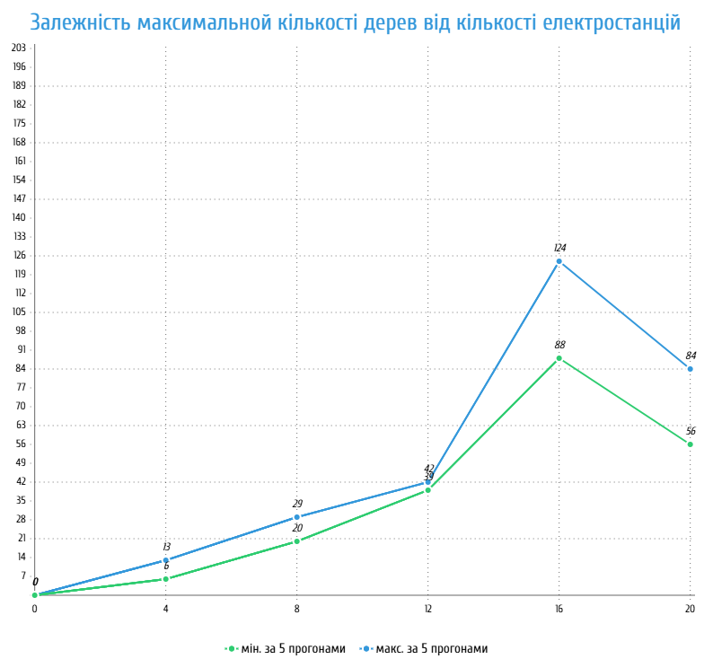

## Комп'ютерні системи імітаційного моделювання
## СПм-24-4, **Ткач Пилип Валерійович**
### Лабораторна робота №**2**. Редагування імітаційних моделей у середовищі NetLogo

 

### Варіант 4, модель у середовищі NetLogo:
[Urban Suite - Pollution](https://www.netlogoweb.org/launch#http://www.netlogoweb.org/assets/modelslib/Curricular%20Models/Urban%20Suite/Urban%20Suite%20-%20Pollution.nlogo)

 

### Внесені зміни у вихідну логіку моделі, за варіантом:

**Реалізація позитивного впливу наявності електростанцій на ймовірність народження людей** - спочатку параметр birth-rate був сталим для всіх агентів і не залежав від розташування.

Замість
<pre>
if health > 4 and random-float 1 < birth-rate
</pre>
у процедурі reproduce створюється локальна змінна local-birth-rate:
<pre>
let local-birth-rate birth-rate
if any? patches in-radius 3 with [is-power-plant?] [
  set local-birth-rate local-birth-rate + 0.05
]
</pre>
Ця змінна спочатку дорівнює birth-rate, та збільшується на 0.05, якщо поблизу клітини є хоча б одна електростанція.
І тепер порівняння випадкового числа здійснюється з новою змінною local-birth-rate
<pre>
if health > 4 and random-float 1 < local-birth-rate [
</pre>
Повний код зміненої процедури:
<pre>
to reproduce
  let local-birth-rate birth-rate
  if any? patches in-radius 3 with [is-power-plant?] [
    set local-birth-rate local-birth-rate + 0.05
  ]
  if health > 4 and random-float 1 < local-birth-rate [
    hatch-people 1 [
      set health 5
    ]
  ]
end
</pre>

**Збільшення ймовірності висадки дерев поблизу електростанцій** - спочатку всі люди мали однакову ймовірність посадити дерево (параметр planting-rate).

За аналогією з попередніми змінами, створюється локальна змінна local-plant-rate. Якщо поблизу (у радіусі 3 клітинок) є електростанція, то ця змінна збільшується на 0.05.
І тепер порівняння випадкового числа здійснюється з новою змінною local-plant-rate.
Замість
<pre>
if random-float 1 < planting-rate [
</pre>
внесемо наступні зміни у процедуру maybe-plant
<pre>
let local-plant-rate planting-rate
if any? patches in-radius 3 with [is-power-plant?] [
  set local-plant-rate local-plant-rate + 0.05
]
if random-float 1 < local-plant-rate [
</pre>
Повний код зміненої процедури:
<pre>
to maybe-plant
  let local-plant-rate planting-rate
  if any? patches in-radius 3 with [is-power-plant?] [
    set local-plant-rate local-plant-rate + 0.05
  ]
  if random-float 1 < local-plant-rate [
    hatch-trees 1 [
      set health 5
      set color green
    ]
  ]
end
</pre>

### Внесені зміни у вихідну логіку моделі, на власний розсуд:

**Додано адаптивну поведінку людей залежно від рівня забруднення навколишнього середовища** - тепер люди оцінюють загальний стан довкілля і змінюють свою поведінку залежно від середнього рівня забруднення всього середовища.

Для цього було додано нову глобальну змінну avg-pollution, яка відображає середній рівень забруднення серед усіх клітин.
<pre>
globals [ avg-pollution ]
</pre>
У процедурі go, після основного циклу роботи агентів, виконується обчислення середнього рівня забруднення:
<pre>
to go
  ...
  set avg-pollution mean [pollution] of patches
  ...
end
</pre>
Змінено логіку пересування агентів (процедура wander)
<pre>
to wander
  if avg-pollution > 3 [
    rt random-float 80
    lt random-float 80
    fd 1.5
    set health health - 0.2
  ]
  if avg-pollution <= 3 [
    rt random-float 30
    lt random-float 30
    fd 1
    set health health - 0.05
  ]
end
</pre>
тепер, якщо середній рівень забруднення перевищує 3, люди поводяться більш хаотично: вони частіше змінюють напрямок руху, пересуваються швидше, але водночас втрачають більше здоров’я.

Також змінено логіку народжуваності (процедура reproduce)
<pre>
to reproduce
  let local-birth-rate birth-rate
  if avg-pollution > 4 [ set local-birth-rate local-birth-rate - 0.03 ]
  if any? patches in-radius 3 with [is-power-plant?] [
    set local-birth-rate local-birth-rate + 0.05
  ]
  if health > 4 and random-float 1 < local-birth-rate [
    hatch-people 1 [ set health 5 ]
  ]
end
</pre>
тепер, коли середнє забруднення перевищує 4, базова ймовірність народження зменшується на 0.03. Якщо поблизу є хоча б одна електростанція, до базового коефіцієнта народжуваності додається 0.05.

Фінальний код моделі доступний за [посиланням](new_netlogo_code.txt).
 

## Обчислювальні експерименти

### 1. Вплив кількості електростанцій на максимальну кількість дерев
Досліджується, як зміна параметру POWER-PLANTS впливає на максимальний показник посаджених дерев.
**Ми змінили логіку моделювання таким чином, що тепер ймовірність висадки дерев поблизу електростанцій збільшується на 0.05.**
Кількість електростанцій змінюється від 0 до 20 з кроком 4.
Модель запускається при наступних параметрах:
- **initial-population**: 30
- **birth-rate**: 0.04
- **planting-rate**: 0.0
- **polluting-rate**: 1

<table>
<thead>
<tr><th>Кількість електростанцій</th><th>Макс. кількість дерев (мін. значення за 5 прогонами)</th><th>Макс. кількість дерев (макс. значення за 5 прогонами)</th></tr>
</thead>
<tbody>
<tr><td>0</td><td>0</td><td>0</td></tr>
<tr><td>4</td><td>6</td><td>13</td></tr>
<tr><td>8</td><td>20</td><td>29</td></tr>
<tr><td>12</td><td>39</td><td>42</td></tr>
<tr><td>16</td><td>88</td><td>124</td></tr>
<tr><td>20</td><td>56</td><td>84</td></tr>
</tbody>
</table>

Графік наочно показує залежність максимальной кількості дерев від кількості електростанцій.
