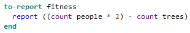
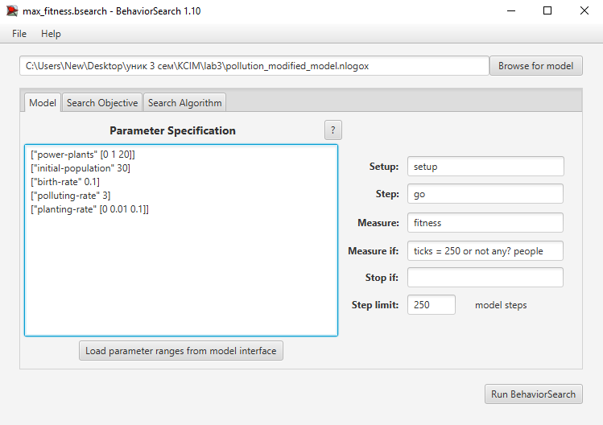
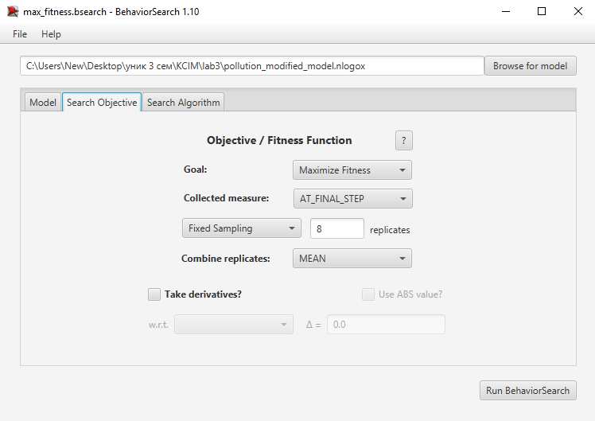
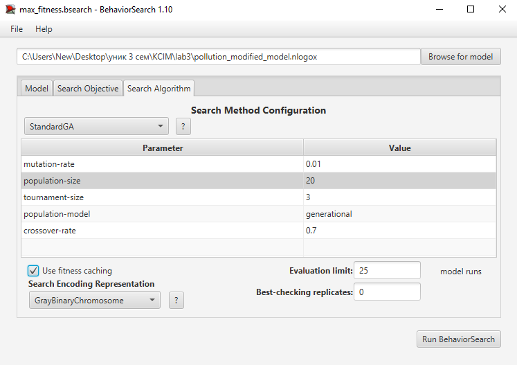
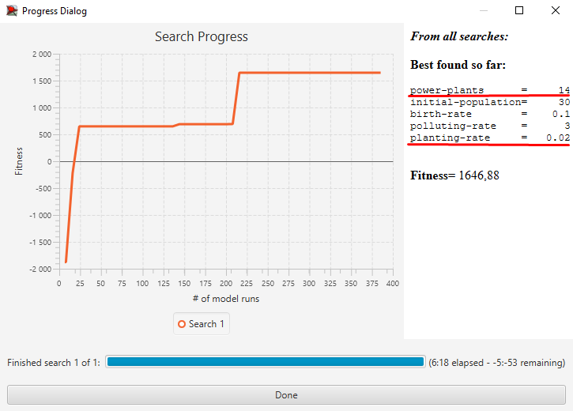

## Комп'ютерні системи імітаційного моделювання
## СПм-24-4, **Ткач Пилип Валерійович**
### Лабораторна робота №**3**. Використання засобів обчислювального интелекту для оптимізації імітаційних моделей

 

### Варіант 4, модель у середовищі NetLogo:
[Urban Suite - Pollution](https://www.netlogoweb.org/launch#http://www.netlogoweb.org/assets/modelslib/Curricular%20Models/Urban%20Suite/Urban%20Suite%20-%20Pollution.nlogo)

 

#### Вербальний опис моделі:
Ускладнена версія моделі [Urban Suite - Pollution](https://www.netlogoweb.org/launch#http://www.netlogoweb.org/assets/modelslib/Curricular%20Models/Urban%20Suite/Urban%20Suite%20-%20Pollution.nlogo).
Я дуже довго думав, як до моєї моделі взагалі застосувати BehaviourSearch, яку функцію тут потрібно мінімізувати (або максимізувати), та якими будуть параметри. Також мені хотілося, щоб вирішення задачі (знаходження оптимуму) було нелінійним. Враховуючи це, я прийшов до наступної ідеї:
1) Додавання електростанцій повинно позитивно впливати на фітнес-функцію.
2) Забагато посаджених рослин повинно зменшувати фітнес-функцію.
3) Рівень народжуваності повинен бути незмінним і дорівнювати 0.10, бо інакше чисельність популяції швидко колапсує (до 0 або нескінченності).

Враховуючи це, перша модифікація, яку я зробив - вирогідність народжування стає трохи вищою, в залежності від кількості електростанцій поблизу. Нова процедура reproduce:
<pre>
to reproduce
  let base-rate birth-rate

  let nearby-plants count patches in-radius (3 + random 3) with [ is-power-plant? ]
  let adjusted-rate base-rate + (nearby-plants * 0.03)

  if health > 4 and random-float 1 < adjusted-rate [
    hatch-people 1 [
      set health 5
    ]
  ]
end
</pre>
Ось як обчислюється фітнес-функція, яку потрібно максимізувати:
<pre>
to-report fitness
  report ((count people * 2) - count trees)
end
</pre>
тобто BehaviorSearch буде намагатись максимізувати чисельність популяції, мінімізуючи кількість посаджених дерев, що робить пошук оптимальних параметрів нелінійною задачою.

#### Керуючі параметри:
Керуючи параметри залишив незмінними. BehaviorSearch буде оптимізовувати лише **planting-rate** та **power-plants**.
- **initial-population** визначає кількість людей на початку симуляції.
- **birth-rate** визначає імовірність народження дитини кожним агентом за умови достатнього рівня здоров’я.
- **planting-rate** визначає імовірність, з якою людина садить дерево.
- **power-plants** визначає кількість джерел забруднення (електростанцій).
- **pollution-rate** визначає рівень забруднення, який створює кожна електростанція.

#### Показники роботи модеі:
- кількість людей у поточний момент часу.
- кількість дерев у середовищі.
- загальний рівень забруднення.
- час виживання популяції.

 

### Налаштування середовища BehaviorSearch:

**Обрана модель**:
<pre>
./pollution_modified_model.nlogox
</pre>
що є модифікацією моделі:
<pre>
C:\Program Files\NetLogo 7.0.2\models\Curricular Models\Urban Suite\Urban Suite - Pollution.nlogox
</pre>
**Параметри моделі** (вкладка Model):  
<pre>
["power-plants" [0 1 20]]
["initial-population" 30]
["birth-rate" 0.1]
["polluting-rate" 3]
["planting-rate" [0 0.01 0.1]]
</pre>
Для фітнес-функції було обрано **значення кількості популяції**, вираз для її розрахунку наведен в процедурі fitness в коді моделі NetLogo:  
  
та вказано у параметрі "**Measure**":
<pre>
fitness
</pre>
Значення кількості популяції повинно враховуватися **на останньому проці** симуляції, тривалістю якої я обрав 250 тактів.
Параметр "**Measure if**" зі значенням
<pre>
ticks = 250 or not any? people
</pre>
означає, що враховуватиметься тільки останній крок симуляції (або крок, коли кількість популяції буде дорівнювати 0).
Параметр зупинки за умовою ("**Stop if**") у разі не використовувався.  
Загальний вигляд вкладки налаштувань параметрів моделі:  

**Налаштування цільової функції** (вкладка Search Objective):  
Метою підбору параметрів імітаційної моделі, що описує виживання популяції в середовищі із забрудненням, є **максимізація** значення кількості популяції мінус кількість посаджених дерев – це вказано через параметр "**Goal**" зі значенням **Maximize Fitness**. Тобто необхідно визначити такі параметри налаштувань моделі, у яких популяція буде якомога більшою.
Щоб уникнути викривлення результатів через випадкові значення, що використовуються в логіці самої імітаційної моделі, **кожна симуляція повторюється по 8 разів**, результуюче значення розраховується як **середнє арифметичне**. 
Загальний вигляд вкладки налаштувань цільової функції:  

**Налаштування алгоритму пошуку** (вкладка Search Algorithm):  

Загальний вид вкладки налаштувань алгоритму пошуку:  

 

### Результати використання BehaviorSearch:
#### Результат пошуку параметрів імітаційної моделі, використовуючи **генетичний алгоритм**:  

#### Результат пошуку параметрів імітаційної моделі, використовуючи **випадковий пошук**:  

#### Перевірка отриманих результатів
Наостанок, я в "ручному" режимі спробував знайти максимум фітнес-функції. Мої результати зпівпали з тим, що обчислив BehaviorSearch. Найбільш стабільним, за 5 прогонами, і найкращим був результат з 14 електростанціями та ймовірністю посадки дерев = 0.2, інші параметри встановив такі ж самі, які поступали на вхід BehaviorSearch.